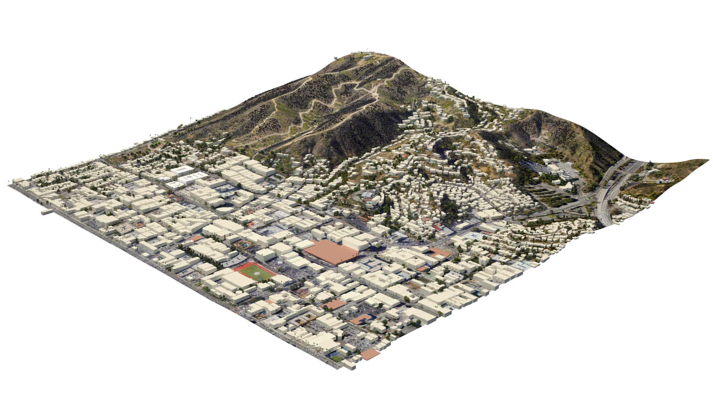
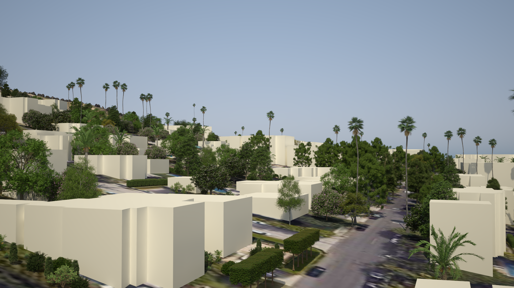
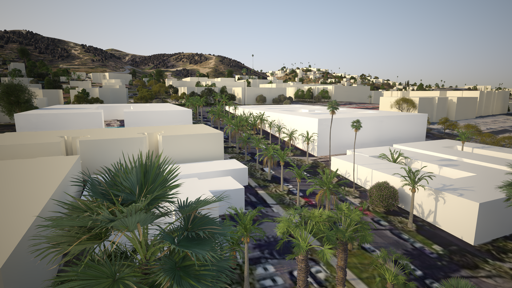

//[[clause-reference]]
== From Data to Visualization

=== 5D Meta World // work from presagis 

=== Visualization Climate Impact on Vegetation

One of the biggest challenges in communicating climate change is to tie global changes to the local impact they will have. Photorealistic visualization is a critical component for assessing and communicating the impact of environmental changes, and possibilities for mitigation. For this to work, it is crucial for visualizations to reflect the underlying data accurately and allow for quick iteration. In this regard, manual visualization processes are inferior. As much as possible, visualizations of real-life scenarios should be driven directly by available data of present states and simulations of possible scenarios. Our contribution is a first attempt at doing just that, determining what already works and what doesn't with existing data and technology.

As our contribution to the Climate Resilience Pilot we explored such data-driven high-quality visualizations, focusing on the impact on vegetation. Due to the nature of this being a pilot, we constrained ourselves in terms of coverage area, to account for limited time and to cope with potentially limited data availability. This ensured that we were able to make the full connection from input data to final visualization, drawing valuable conclusions for broader application in the future. This size limitation will allow us to produce meaningful results if data transfer and processing is slow or even if it must be processed in manual or half-automated ways due to inconsistent formatting. It also lets us visualize a high level of detail without having to account too much for the sheer amount of data we could face with very large areas.

We selected a relatively small section of Los Angeles for actual visualization. The rationale behind this choice of location had several components:

 * The given area that will (and already does) see considerable direct impact of climate change through heat, drought, wildfires, etc.
 * It contains different areas of land use (from deeply urban and sub-urban to unmanaged areas).
 * Since it is part of a major metro area, the results will be relevant to a large population base
 * Some known mitigation measures that can be considered for visualization are in place.
 * Other external (non climate change) known influences on vegetation, such as pests, irrigation limitations, known life spans of relevant plant species, etc.) are in play that could be considered.

==== Source Data

Our visualization ties data that is very global together with data that is hyper-local. That means we need to draw on data from a wide variety of sources that are not usually combined. Examples of data sources used for our visualization are:

* Satellite Imagery
* Building Footprints and Heights
* Plant Inventory from Bureau of Street Services and Department of Recreation and Parks
* Results from Climate Models, Ideally in an Analysis Ready Format
* 3D Plant Models from the Laubwerk database
* Plant Metadata to Judge Climate Change Impact on Specific Species through given Environmental factors, also from the Laubwerk database
* Information on local mitigation measures from various sources

==== Results

The aforementioned data sources were combined to create a detailed visualization of the area in question. The images below show a visualization of the status quo.

.Overview of the Visualized Region
[img-laubwerk-overview]

.Above the Corner Sunset Blvd and N Curson Ave Looking North-East
[img-laubwerk-sunset-blvd-n-curson-ave]
image::images/laubwerk_ogc-crp-2023_230406_v044_jws_camera1.png[Above the Corner Sunset Blvd and N Curson Ave Looking North, ,align=center]

.Corner Franklin Ave And N Sierra Bonita Ave Looking East
[img-laubwerk-franklin-ave-n-sierra-bonita-ave]

.Corner Hollywood Blvd And Camino Palmero St Looking Looking North
[img-laubwerk-hollywood-blvd-camino-palmero-st]

TODO: Add renderings of additional scenarios.

==== Challenges and Learnings

The goal of a visualization like we did is to make data and its implications visible on a hyper-local level. The hope behind this is to turn a large amount of abstract data into something the general public can better judge the very local impact of global changes.

This hyper-locality brings to light a number of problems with the granularity, availability, and machine readability of existing data. Relating to our specific inputs, this means:

* Producing a high fidelity photorealistic 3D model of a specific area is still not easy. Even in an urban area of an industrialized country like we picked (which usually have better data availability), we had to resort to relatively simple elevation data and building footprints. There are solutions for this on the horizon, but general availability is not a given, yet. 3D models based on photogrammetry seem like a promising approach to reach higher fidelity where available, but that generally available datasets like these currently lack classification, so we would not be able to remove and replace vegetation elements. This will probably improve and become more widely available in the near future.
* Information about existing vegetation is of varying quality and completeness. Detailed data is sometimes maintained by different authorities with different scopes. In our case we used data from the https://streetsla.lacity.org/tree-inventory[Bureau of Street Services] as well as the Department of Recreation and Parks. Those datasets have different data layout, different depth and quality of data. OpenStreetMap also sometimes has vegetation data, but coverage and data quality is also problematic. None of the aforementioned really cover individual plants on private property or unmanaged land, which we had to fill in from photogrammetry, satellite imagery, and aerial photography.
* Climate projection data is pretty widely available and generally easy to process in terms of data volume, because the areas a visualization will typically cover is pretty small compared to the resolution of most climate models. What is still a challenge is to turn climate scenario data into properties that are needed to easily model the impact on vegetation, like the probability of extreme drought, heat, or fire events. This was partially addressed by other contributions to this pilot and we expect it to see further improvements.
* Exact data on average plant behavior in the context of relevant climate indicators is extremely patchy. Most data is only qualitatively in nature. Data gathering is complex because of the large number of factors at play when judging health of plants. This is a complex researach topic that will need more work, both to produce more reliable projections based on existing research, but also on how to gather data about or predict plant health more reliably on a large scale.
* Information about climate change mitigation is often not present in a machine readable format. In our specific case, we gathered information manually from publicly available material, mostly websites. Part of the problem here is that several stakeholders are working on mitigation measures, from different local government organizations, over non-profit organizations, to private companies. Examples relevant to our specific example are https://www.cityplants.org/[City Plants] (a non-profit supported by Los Angeles Department of Water and Power) and the https://pw.lacounty.gov/rmd/parkwaytrees/[County of Los Angeles Parkway Trees Program]. This manual way of data gathering obviously will not scale, is prone to data being missed, and has no unified format. All of this makes automated processing next to impossible at the moment.
* There may be further factors that need to be considered, which are not part of any of the existing data sources. In this specific case we have the pretty high average age and also various pests and diseases that the Mexican fan palm (_Washingtonia robusta_), which has become such a distinctive feature of Southern California, especially Los Angeles, is suffering from. While this isn't directly related to climate change, it still needs to be considered for any visualization to be accurate. 

==== Future Work/Outlook

TODO!

