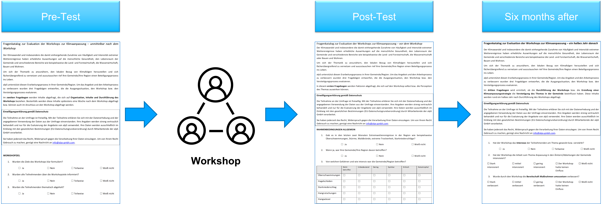
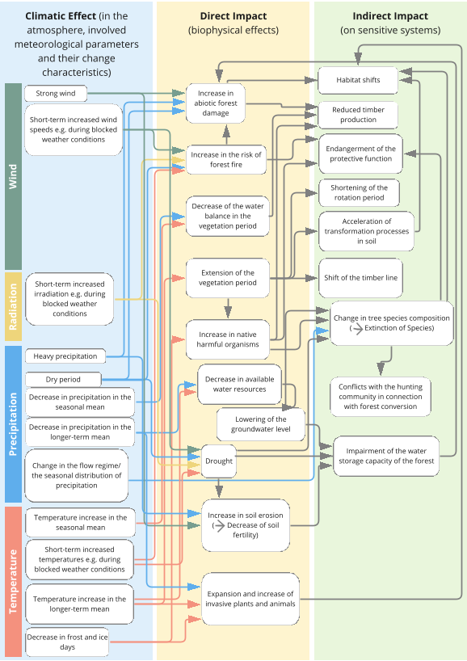

//[[clause-reference]]
== Pathways to a shared understanding of climate impacts at the local level (alpS)

Climate change is happening, and mitigation efforts will simply not be enough  to tackle its impacts. Thus, climate action, mitigation as well as adaptation, at the local level is needed. The alpS GmbH supports communities, regions, and industrial partners in their sustainable development and in dealing with the consequences, opportunities, and risks of climate change. Over the last 20 years alpS has worked with more than 250 municipalities and industrial partners.

In the understanding of alpS, climate change consultancy services are successful, if they trigger the implementation of proactive measures that are supported by a large part of actors. However, the degree of effectiveness of the consultancy services of alpS as a function of various communication methods (e. g. intro presentations including processed local climate data, information processing, moderation techniques, discussion tools) and scientific know-how has never been systematically investigated. In the pilot project, alpS therefore evaluated its inventory of methods used in its climate change adaptation workshops and started with the improvement of the workshop setup and aspects of communication.

=== Approach
alpS conducted a structured evaluation of available datasets of participatory processes with the aim to improve the level of information about climate change impacts and to identify the broadest accepted way of presenting user-related scientific statements. The assessment of adaptation cycles at different spatial levels allowed the further development and improvement of suitable interoperable solutions.

A set of questions was developed to measure the success of vulnerability workshops.  This involved developing questions on workshop content (e.g., climate information, methodological approach) and permanence (e.g., adaptation measures implemented), in addition to external factors that influence workshop outcomes (e.g., political backing, human resources, time spent, financial commitment to adaptation, geographic conditions). Using a three-step process, workshop participants were surveyed before the workshop, immediately after the workshop, and six months after the workshop. As part of a pre-test, communities were surveyed that were just before or after a workshop at the time of the Climate Resilience Pilot, or where six months had already passed.

.Three-part questionnaire

=== Main results
Assessment of climate impacts must be done at local level
Communication must not be too complicated, but should not leave anything out (especially when it comes to climate impacts)
Adaptation needs identification should focus on a few but urgent adaptation measures
Process support and collaboration of different local actors is essential
Active contact person in the community is necessary

==== Improvement of communication
In the current workshop design of the vulnerability workshops of alpS, local climate impacts are assessed on a matrix. The responses from workshop participants highlighted the importance of clear, unambiguous, and simple language when communicating climate impacts. Inspired by the responses of the workshop participants, the wording of climate impacts was optimized and broken down in the context of an impact chain from climatic effect  to direct and indirect climate impacts.

.Climate impact chain for the forestry sector

=== Outlook
Overall, the consensus at the Closing Workshop in Huntsville was to focus more on stakeholder participation and to start from the stakeholders' questions instead of the raw data. This would put communication at the center of upcoming project phases.

=== Summary
- Component: Climate communication and support for adaptation.

- Inputs: Selected climate indicators (past and future, different scenarios), cartographic data (hazard zones, hq areas, etc.), existing plans, strategies and concepts (regional development plans, climate protection strategies, previous analyses), and most important local climate and resilience information from stakeholders.

- Outputs: Target group-specific communication material (factsheets, graphs), description of the vulnerability and visualization of risk maps, adaptation measures, strategies for adaptation to climate change. In the context of this pilot alpS improved its communication methods and shared its findings to allow the Climate Community to copy and transform as many use-cases as possible to other locations or framework condition.

- What other component(s) can interact with the component: All components that deliver dri. Also, any component that needs user feedback or a test group, or that wants to develop data as part of a participatory process.

- What OGC standards or formats does the component use and produce: Processed local climate data, NetCDF.
