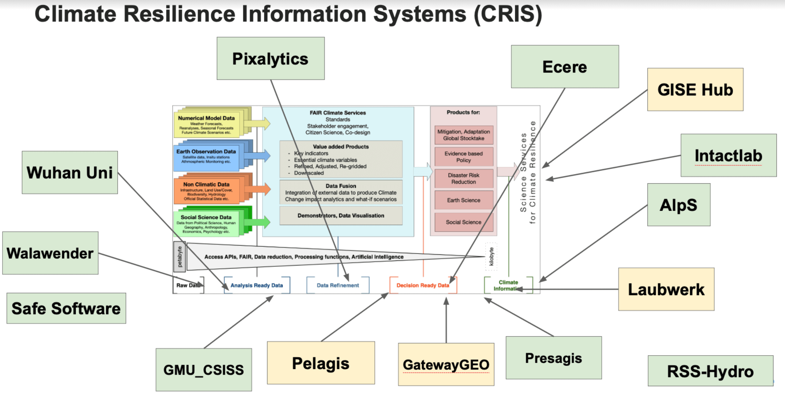
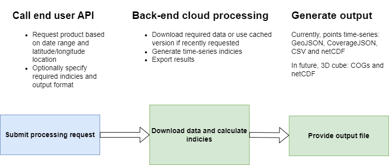

[[clause-reference]]
== Components
The various organizations and institutes that contribute to the Climate Resilience Pilot are described below. There input to the pilot is indicated in the figure below <<CRIS>>. 

[[CRIS]]
.CRIS overview

=== ECMWF - Cppernicus

- Component: Copernicus services.

- Outputs: Copernicus Services, including Climate Data Store (CDS) https://cds.climate.copernicus.eu/ and Atmosphere Data Store (ADS) https://ads.atmosphere.copernicus.eu/. 

- What other component(s) can interact with the component: CDS and ADS provide access to data via different interfaces: UI and API. It also offers a toolbox with a set of expert libraries to perform advanced operations on the available data. CDS and ADS catalogue metadata is also accessible via standard CSW. https://cds.climate.copernicus.eu/geonetwork/srv/eng/csw?SERVICE=CSW&VERSION=2.0.2&REQUEST=GetCapabilities

- What OGC standards or formats does the component use and produce: 
  * CDS and ADS catalogues exposed via CSW. 
  * Access to ESGF datasets via WPS. 
  * WMS is offered in some published applications. 
  * CADS 2.0 (under construction) will implement OGC APIs.

=== Pixalytics

Pixalytics are developing an OGC-compliant API service, see <<Pixalytics_architecture>>, which will provide global information on droughts. The approach is to take global open data/datasets from organizations such as ESA/Copernicus, NASA/NOAA and the WMO and combine meteorology, hydrology, and remote sensing data to produce ARD data based on a composite of different indicators. Where globally calculated drought indicators already exist, these are being used in preference to their re-calculation, although consistency and the presence of uncertainties are also being considered.

[[Pixalytics_architecture]]
.Pixalytics architecture

Currently, the Standardized Precipitation Index (SPI) is being calculated using ERA5 reanalysis data from the Copernicus Climate Change Service. The API access is being set up following the Building Blocks for Climate Services (https://climateintelligence.github.io/smartduck-docs/) approach. Once all steps are working for SPI, the next step is adding soil moisture and vegetation drought indices. Also, work on how to combine indices into a single view/indicator is being considered.

- Component: Drought indicator.

- Inputs: Meteorological data, including Precipitation, plus Land Surface Temperature, Soil Moisture, Vegetation Index (or optical data to calculate it from).

- Outputs: Drought Indices - as a time-series dataset output in JSON or COG format.

- What other component(s) can interact with the component: a desire to link to visualization/DRI analysis components. A QGIS plugin has been updated to be able to perform a request and view the outputted JSON file (https://github.com/pixalytics-ltd/qgis-wps-plugin) and the WPS link is https://api.pixalytics.com/climate/wps?request=GetCapabilities&service=wps (under testing/improvement for robustness).

- What OGC standards or formats does the component use and produce: Producing data on-the-fly using the Web Processing Service (WPS), so need to pull data through preferably an API route.

=== Wuhan University (WHU)
Wuhan University (WHU) is a university that plays a significant role in researching and teaching all aspects of surveying and mapping, remote sensing, photogrammetry, and geospatial information sciences in China. In this Climate Resilience Pilot, we will contribute two use-cases: a use-case for drought and wildfire impact, and a use-case for analysis ready data.

- Component:  Data Cube and Drought Indicator.

- Inputs: Climate data, including precipitation and temperature. Optical data, such as Landsat-8 and sentinel-2.

- Outputs: Drought risk map and other results in the form of GeoTIFF after processing in a Data Cube.

- What other component(s) can interact with the component: .

- What OGC standards or formats does the component use and produce: 
  * OGC API - Coverages to provide the data in Cube
  * OGC API - Processes to provide the calculation of drought indices
 
=== Ecere Corporation

Ecere is providing a deployment of its GNOSIS Map Server with a focus on a Sentinel-2 Level 2A data cube. _OGC API - Tiles_, _OGC API - Coverages_, _OGC API - Maps_, _OGC API - Discrete Global Grid Systems_, _Common Query Language (CQL2)_, and  _OGC API - Processes - Part 3: Workflows & Chaining_ are the supported standards and extensions for this task.

Plan to use the process output to identify vegetation fuel type, then combine with weather data to assess wildfire hazards risk in Australia. 

- Component: Data Cube and Wildfire vegetation fuel map / risk analysis.

- Inputs: ESA Sentinel-2 L2A data (from AWS / Element 84), Temperature / Precipitation / Wind climate data, Reference data for training: vegetation fuel type classification, wildfire risk.

- Outputs: OGC API (Coverage, Tiles, DGGS, Maps) for Sentinel-2 data (https://maps.gnosis.earth/ogcapi/collections/sentinel2-l2a) including full global coverage, all resolutions/scales, all bands that can be individually selected, CQL2 expressions for band arithmetics; climate data (to be added), vegetation fuel type (possibly by end of pilot, or for DP2023), wildfire risk workflow (possibly by end of pilot, or for DP2023).

- What other component(s) can interact with the component: Any OGC API client component requiring efficient access to Sentinel-2 data, clients requiring climate data once made available, clients presenting vegetation fuel type, wildfire risk (once ready, might extend into DP2023).

- What OGC standards or formats does the component use and produce: 
  * OGC API (Coverage - with subsetting, scaling, range subsetting, coverage tiles; Tiles, DGGS (GNOSISGlobalGrid and ISEA9R), Maps (incl. map tiles), Styles), CQL2, OGC API - Processes with Part 3 for workflows (Nested Local/Remote Processes, Local/Remote Collection Input, Collection Output, Input/Output Field Modifiers) 
  * Formats: GNOSIS Map Tiles (Gridded Coverage, Vector Features, Map imagery, and more); GeoTIFF; PNG (16-bit value single channel for coverage, RGBA for maps); JPEG. 

=== Jakub P. Walawender

- Component: Solar climate atlas for Poland.

- Inputs: In situ solar radiation and sunshine duration data, satellite-based solar radiation and sunshine duration estimates (climate data records), various different geospoatial data from different sources (e.g. digital elevation model, climate zones, etc.).

- Outputs:
  * This pilot outputs: Review of available solar radiation datasets and web services, 2 scripts (solar climate data exploratory analysis tool, solar climate data preprocessing tool), report summarizing results of the exploratory data analysis and quality control including discussion of inconsistency factors.
  * In the final result: solar radiation data cube for Poland (40 years of high resolution dataset for selected solar radiation variables), and analysis ready data (dedicated products for different solar-smart applications in the fields of renewable energy, agriculture, spatial planning, tourism, etc.), detailed analysis of the solar climate in Poland (incl. solar regionalisation) and online web map service with an interactive, self-explainable interface enabling easy on-demand information access.

- What other component(s) can interact with the component: This component work (considering the final result) crosses all the components and all of them are actually important.

- What OGC standards or formats does the component use and produce: 
  * NetCDF compliant with the CF (Climate and Forecast) convention. 
  * WMS, WCS, OGC API

=== Safe Software

- Component:
 * Climate ARD component - Data Cube to ARD.
 * Impact Components general I/O (Heat, Drought, Flood).

- Inputs: 
 * Climate ARD component - Data Cube to ARD: Climate scenario data from climate services (NetCDF), for historic and future time periods
 * Impact Components general I/O (Heat, Drought, Flood): Climate impact ARD from Safes ARD component, including EO data (MODIS, LANDSAT, SENTINEL products), Population/Infrastructure information (OSM), Basemaps, as well as specific requirements per impact:
  * Drought: vegetation, soils, hydrology, basins
  * Flood: DEM, hydrology, basins.

- Outputs:
 * Climate ARD component - Data Cube to ARD: Gridded data, including temperature, soil moisture and  precipitation - aggregate grids (GeoTIFF/COG), as well as Vector data, including temperature, soil moisture and  precipitation contours (Geopackage, GeoJSON, OGC API Features).
 * Impact Components general I/O (Heat, Drought, Flood): Risk Contours (Geopackage, GeoJSON, OGC API Features).

- What other component(s) can interact with the component: Pixalytics Component: consume variables for Drought Indicator produced by Safe’s ARD component. Any other component that requires climate scenario summary ARD to drive DRI.

- What OGC standards or formats does the component use and produce: 
 * OGC API Features
 * Geopackage
 * NetCDF
 * GeoJSON
 * GeoTIFF/COG
 * As needed: GML, KML, PostGIS, geodatabase and about 400 other geospatial formats.

[[FMEARDworkflow]]
.High level FME ARD workflow showing generation of climate scenario ARD and impacts from climate model, EO, IoT, infrastructure and base map inputs
image::images/FME_ARD_workflow.png[FME_ARD_workflow]

=== GMU_CSISS

- Component: Analysis Ready Data (ARD).

- Inputs: ECV record information, OpenSearch service endpoint (currently CMR(CWIC) and FedEO), download URLs for accessing NetCDF or HDF files.

- Outputs: WCS service endpoint for accessing selected granule level product images (GeoTIFF, PNG, JPEG, etc.).

- What other component(s) can interact with the component: .

- What OGC standards or formats does the component use and produce: 
  * WCS for downloading image
  * WMS for showing layers on basemap

=== Pelagis

=== GatewayGEO

=== Presagis

=== Laubwerk

=== AlpS

- Component: climate Communication and support for adaptation.

- Inputs: Selected climate indicators (past and future, different scenarios), cartographic data (hazard zones, HQ areas, etc.), existing plans, strategies and concepts (regional development plans, climate protection strategies, previous analyses).

- Outputs: Target group-specific communication material (factsheets, graphs), description of the vulnerability and visualization of risk maps, adaptation measures, strategies for adaptation to climate change. In the context of this pilot alpS will elaborate a guideline that helps to find a proper workshop-setup. alpS will illustrate the guideline with two to three best practice examples. As far as possible, alpS will test its findings in ongoing consultancies.

- What other component(s) can interact with the component: .

- What OGC standards or formats does the component use and produce: .

=== Intactlab

=== GISE Hub

=== RSS-Hydro
