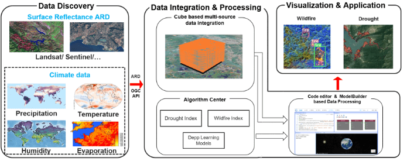
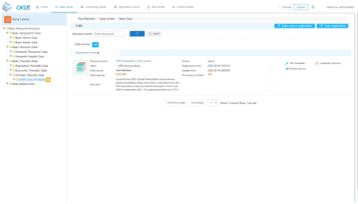
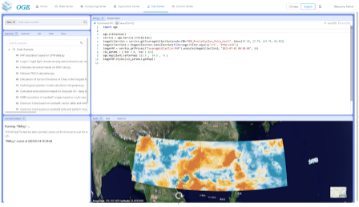
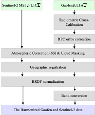
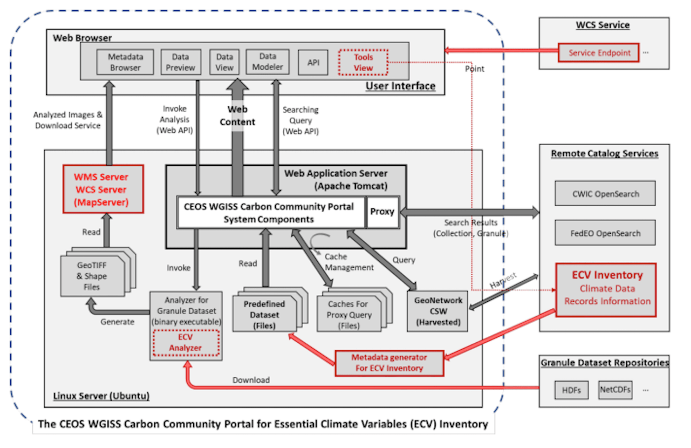
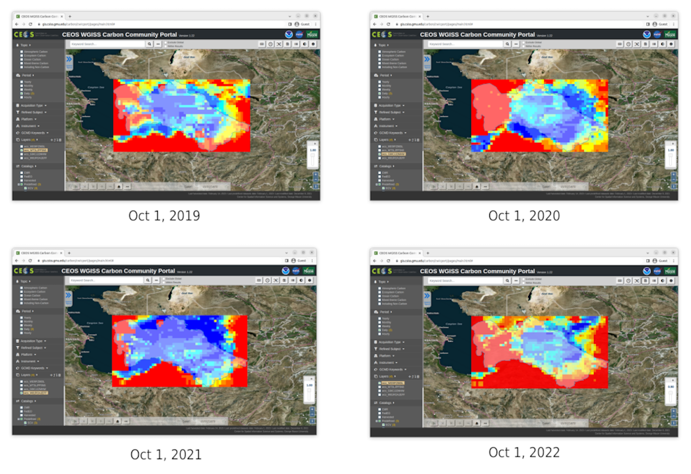
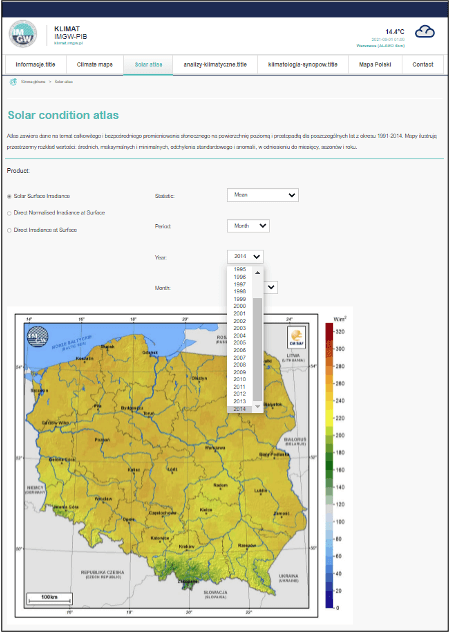

== Use cases

=== Drought and Wildfire Impact Use-case
Drought and wildfire caused by climate change are one of the important factors affecting agricultural production, food security, and water shortage. The goal of WHU is to develop a use-case for drought and wildfire risk assessment for rapid response to drought and wildfire occurrences. Figure 1 shows the technical architecture on how WHU contributed to the use-case. It has the following features: 1) For data discovery, a catalogue service from data center following OGC API is provided allowing users to search geospatial data both available from WHU data stores and remote data stores from USGS, ESA, and NASA. 2) For data integration, data can be integrated into the WHU software in the form of geo date cubes with three efforts: formalizing cube dimensions for multi-source geospatial data, processing geospatial data query along cube dimensions, and organizing cube data for high-performance geoprocessing. 3) For data processing, a processing chain is enabled in WHU software using a code editor and modelbuilder. 4) For data visualization, a Web-based client for visualization of spatial data and statistics is provided using a virtual globe and charts. 

.The technical architecture of the use-case for drought and wildfire impact

Figure 2 a is the data center of the proposed use-case, which currently stores multiple sources data from different platforms including 20 years of precipitation data from GPM (Global Precipitation Measurement) used to calculate the drought index. The drought and wildfire risk assessment algorithms are integrated in the algorithm center, which can be invoked by the code editor or modelbuilder to perform drought and wildfire risk assessment. Figure 2b shows the Python code and visualization result of the drought risk assessment in Asia based on precipitation anomaly percentage (PAP) index.

---

[%unnumbered]

.An example of the drought risk assessment in parts of Asia.

---

=== Analysis Ready Data Use-case
The technical design on how WHU contributed to the ARD use-case encompasses the query, download, and pre-processing of multi-source EO data. The query and download operators collect open EO data from open EO providers (USGS, ESA, and NASA). In addition to EO datasets, we also provide meteorological datasets including ECMWF climate reanalysis and MODIS atmospheric products. The pre-processing workflows create ARD for both optical and SAR imagery. Moreover, for applications that need spectral and angular harmonization, the pre-processing workflow supports the harmonization of multi-source optical imagery. Figure 1 shows the processing chain to produce harmonized ARD. The harmonization involves spatial co-registration, band conversion, and bidirectional reflectance distribution function (BRDF) correction.

.The processing chain to produce harmonized ARD

To demonstrate our ability to produce ARD and promote the use of Chinese satellite data, we will produce a surface reflectance ARD dataset through the harmonization of Gaofen-1 WFV (Wide Field of View), Gaofen-6 WFV, and Sentinel-2 data. Figure 2 shows the Sentinel-2 data before and after pre-processing. Besides, we’d like to coordinate with the ARD SWG to promote standards for ARD and ensure that the ARD we produce is stable and reusable. Furthermore, we wish to seek the assessment of CEOS-ARD in our long-term plan.

.Sentinel-2 RBG composite (red Band4, green Band3, blue Band2), over Hubei, acquired on October 22, 2020. (a) corresponds to the reflectance at the top of the atmosphere (L1C product), (b) corresponds to the surface reflectance after pre-processing.
image::images/WHU-Sentinel2-RBG-composite.png[Sentinel2Composit]

=== Analysis Ready Data (ARD) Use Case (D-100 Client instance by George Mason University)

==== Background

Definition of Analysis Ready Data (ARD) (defined by CEOS):

[%unnumbered]

----

Analysis Ready Data (ARD) is remote sensing data and products that have been pre-processed and organized to allow immediate analysis with little additional user effort and interoperability both through time and with other datasets.

----

Major steps in preparing satellite data into ARD include conversion of
raw reading into radiometric quantity, quality assessment, quantity
normalization, and temporal integration. The ARD should follow the FAIR
(Findable, Accessible, Interoperable, and Reusable) Data Principles.

Immediate analysis requires that data obtained by the data users exactly
matches users' specification in the format, projection, spatial/temporal
coverage and resolution, and parameters so that it can be ingested into
user's analysis system immediately without further efforts. Since
individual data users and projects have different requirements
personalized services for customizing the data must be provided in order
to meet the requirement of immediate analysis, which we call ARD
services.

Essential Climate Variables (ECV) are key data sets for climate change
studies. https://climatemonitoring.info/ecvinventory/[ECV Inventory]
houses information on Climate Data Records (CDR) provided mostly by CEOS
and CGMS member agencies. The inventory is a structured repository for
the characteristics of two types of GCOS ECV CDRs:

* Climate data records that exist and are accessible, including
frequently updated interim CDRs
* Climate data records that are planned to be delivered.

The ECV Inventory is an open resource to explore existing and planned
data records from space agency sponsored activities and provides a
unique source of information on CDRs available internationally. Access
links to the data are provided within the inventory, alongside details
of the data's provenance, integrity and application to climate
monitoring.

The client is used the existing
https://gis.csiss.gmu.edu/carbon/cwicport/pages/main.html[CEOS WGISS
Community Portal]. The portal is capable
of providing automated discovery and customization services of ECV and
satellite data. The client will be able to discover and access ECV and
other remote sensing data and customize them into ARD for anywhere in
the world to support various climate change resilience analysis.

==== Approach

The client instance is implemented as a Web application to support the
creation and delivery of ARD for climate change impact assessment.

The Carbon Portal conducted data discovery and access in two steps:

* step 1: Data collection search
* step 2: Granule search to search granules in the collection

ARD services are enabled on results of granule search if the collection
is an ECV. If the ECV data provider has implemented the WCS service for
the dataset, the portal will directly communicate with ECV provider's
WCS server for ARD service. If the ECV data provider does not have the
WCS service, the portal's server will download entire granule and stage
it on the portal server to provide ARD service.

Most of ECV data provides don't provide such service.

The following figure is a software architecture of the CEOS WGISS Carbon
Community Portal.

//[cols="^",options="header",]
//|====
//| image::images/ARD_GMU-architecture.png[image]
//|Software Architecture
//|====

.Software Architecture

ECV Inventory v4.1 records are converted as a unified form of the portal
predefined metadata format by a converting tool. Retrieve collection
metadata for ECV entries from CWIC/FedEO OpenSearch referred by Data
Record Information. There is 1251 ECV inventory records (Same as
WGClimate, 870 for Existing, 381 for Planned). The portal supports
totally 1910 predefined ECV relative collection datasets from ECV
Records.

ARD service for ECVs in case that providers have no WCS services:

* Support when user select one granule entry
* Download granule dataset file from given repository, and manipulate it
for serving WCS
* Stage the data in portal backend server and generate a list of all
coverages in the granule
* User specifies the specifications of data to download
* User obtains the customized data by downloading via WCS GetCoverage
request

ARD service for ECVs with data providers’ WCS:

* Directly talk to provider’s WCS
* Without granule downloading and stage steps in the portal’s backend
server.

==== Use Case: The climate change impact on crop production in Turkmenistan

The use case of the climate change impact on crop production in
Turkmenistan. However, the portal can switch to another use case or
support multiple use cases if this pilot requests us to do so.

Drought is one of the major climate-related natural hazards that cause
significant crop production loss in Turkmenistan. Climate change
increases the risk of drought in Turkmenistan. Crop models (such as
WOFOST) are often used to support the decision-making in long-term
adaptation and mitigation. The client will be used to prepare data to be
readily used as parameters and drivers in such modeling processes.
Drought impact analysis data may include long time series of
precipitation, temperature, or indices for crop conditions, water
content, or evapotranspiration. Many of these climate data and products
from satellite sensors are served at NASA's Goddard Earth Sciences Data
and Information Services Center, such as GPM data products, MERRA
assimilated climate data. These will be used in the case of drought
impact assessment in Turkmenistan.

The drought impact ARD case will demonstrate:

[arabic]
. Applicability of open standards and specifications in support of data
discovery, data integration, data transformation, data processing, data
dissemination and data visualization
. Transparency of metadata, data quality and provenance
. Efficiency of using ARD in modeling and analysis
. Interoperable dissemination of ARD abiding by FAIR principles

The searching is starting with the following information:

* Keyword: surface soil moisture
* Filter: daily
* Date: 10/1/2021, 10/1/2020, 10/1/2019, 10/1/2018
* Area: Turkmenistan (Bbox: 52.264(Left), 35.129(Bottom), 66.69(Right),
42.8(Top))

Choose a collection dataset:

[%unnumbered]

----

Groundwater and Soil Moisture Conditions from GRACE and GRACE-FO Data Assimilation L4 7-days 0.25 x 0.25 degree Global V3.0 (GRACEDADM_CLSM025GL_7D) at GES DISC  

----

Choose the following granule data file:

[%unnumbered]
----

GRACEDADM_CLSM025GL_7D.3.0:GRACEDADM_CLSM025GL_7D.A20220926.030.nc4 (for year 2022)
GRACEDADM_CLSM025GL_7D.3.0:GRACEDADM_CLSM025GL_7D.A20210927.030.nc4 (for year 2021)
GRACEDADM_CLSM025GL_7D.3.0:GRACEDADM_CLSM025GL_7D.A20200928.030.nc4 (for year 2020)
GRACEDADM_CLSM025GL_7D.3.0:GRACEDADM_CLSM025GL_7D.A20190930.030.nc4 (for year 2019)

----

Retreve the file and choose a variable:

[%unnumbered]
----

sfsm_inst (Surface soil moisture percentile)

----

Adjust legend color (0 is the least soil moisture), and get the
following results:

//[cols="^",options="header",]
//|====
//|  image::images/ARD_GMU-demo-sfsm_inst.png[image]
//|Surface soil moisture percentile (year 2019-2022)
//|====

.Surface soil moisture percentile (year 2019-2022)

=== Solar climate atlas for Poland - Climate Resilience Information System
Jakub P. Walawender (Freelance climate scientist and EO/GIS expert)
email:contact@jakubwalawender.eu

The project aims at updating previously created solar climate atlas for Poland by:

* increasing spatial and temporal resolution of the datasets;
* extending time span
* replacing static maps with a dynamic and interactive interface;
* using practical solar radiation parameters instead of physical variables;
* making datasets (+ metadata) available for downloaded 
in interoperable file formats for further use
* sharing a solar climate knowledge base and data/service user guide 

in order to:

* advance development of the solar-smart society and economy in PL
* provide know-how and tools, which are easily reusable in other geographical regions

//|===
//|  //image::Jakub-SolarConditionAtlas.png[]
//|Solar Climate atlas for Poland available on the IMGW website: https://klimat.imgw.pl/en/solar-atlas
//|===

.Solar Climate atlas for Poland available on the IMGW website: https://klimat.imgw.pl/en/solar-atlas

Newly created *solar climate data cube and web map service* will be more *FAIR* as they will be made available online, possibly on the official website of the Polish Hydrometeorological Service (IMGW) for an increased findability, upon future agreement (to be discussed) to make them more *Findable* by the general public. The whole process of data access (including authentication) will be transparent and accompanied by appropriate instructions so that the *Accessibility* could be much higher. The format of the datasets in the data cube will be an OGC netCDF standard compliant with the CF (Climate and Forecast) convention, which is suitable for encoding gridded data for space/time-varying phenomena and commonly known in the climate science community but also easily readable with other common spatial data processing and visualization software including most of the GIS software to keep fully *Interoperable*. Finally, even though the proposed solar climate information system (maps+ dataset) are limited to the area of Poland, all processing scripts will be made available on github along with a well-described processing steps (both Jupyter notebooks and instructional videos will be considered) to provide *Reusability* for other countries or geographical regions.

*Two objectives for the pilot OGC Climate Resilience Pilot are:*

* to document existing solar radiation datasets (satellite, model and reanalysis data) and services (both freely accessible and commercial)
* to verify the accuracy of the in situ measurements and satellite climate data records for the selected solar radiation parameters using proper statistical methods
